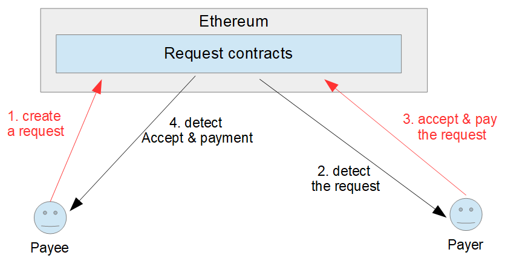
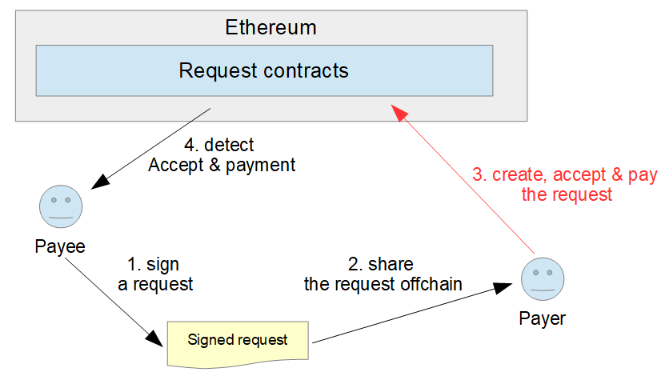

# Signed Request

### Why do we need signed request?

When dealing with B2B invoices, you especially need to broadcast your transaction on the blockchain so that your client can detect it automatically. But when you are at a Point of Sale or an online store, the vendor doesn’t need to broadcast the invoice on the blockchain. If he did so, the buyer would have to wait for blockchain confirmation and it would add a gas cost as the process would need 2 transactions on the blockchain.



The solution to bypass the invoice broadcasting is to work on an ECDSA optimization where the seller encrypts his transaction, provides it to the client who accepts the invoice, pays it and broadcasts it in a single transaction. Most blockchain systems \(including Ethereum and Bitcoin\) use the Elliptic Curve Digital Signature Algorithm \(ECDSA\) for cryptographically signing transactions. We use it to prove that the sender of the transaction had access to a private key and that the transaction has not been changed since it was signed.



In the signed request workflow, only one Ethereum transaction is needed:

1. The payee creates a signed request. \(see how to do it below\)
2. The payee shares the signed request to the payer.
3. From this point, the payer can create the request on behalf of the payee. It can also accept and pay it in only one transaction.
4. The payee can scan the Ethereum blockchain to detect when the signed request is broadcasted.

### The signed request object

A signed request is a json object containing all the information needed to create a request plus the signature of the creator:

```text
{
    "currencyContract": "Address of the currency contract",
    "data": "hash of the ipfs file(optional)",
    "expectedAmounts": "amount initial expected per payees for the request",
    "expirationDate": "unix timestamp of expiration date( in second)",
    "hash": "solidity hash of the request data",
    "payeesIdAddress": "ID addresses of the payees(the position 0 will be the main payee)",
    "payeesPaymentAddress": "payment addresses of the payees(the position 0 will be the main payee)(optional)",
    "signature": "signature by payee of the hash"
}
```

For example:

```javascript
{  
"currencyContract":"0xf12b5dd4ead5f743c6baa640b0216200e89b60da",
   "data":"QmbFpULNpMJEj9LfvhH4hSTfTse5YrS2JvhbHW6bDCNpwS",
   "expectedAmounts":[  
      "100000000",
      "20000000",
      "3000000"
   ],
   "expirationDate":7952342400000,
   "hash":"0x914512e0cc7597bea264a4741835257387b1fd66f81ea3947f113e4c20b4a679",
   "payeesIdAddress":[  
      "0x821aea9a577a9b44299b9c15c88cf3087f3b5544",
      "0x0d1d4e623d10f9fba5db95830f7d3839406c6af2",
      "0x2932b7a2355d6fecc4b5c0b6bd44cc31df247a2e"
   ],
   "payeesPaymentAddress":[  
      "0x6330a553fc93768f612722bb8c2ec78ac90b3bbc",
      null,
      "0x5aeda56215b167893e80b4fe645ba6d5bab767de"
   ],
   "signature":"0xbe2cc3516f1805ab619f550a16e39cb435a9873dd3c1a6dff430a345c30b206515217da7430306207c7cf06e092c84ef0fb3def78c87e4488a5babc8c6f9761a01"
}
```

You can create signed request with the library: [https://docs.request.network/development/using-the-javascript-library\#signed-requests](https://docs.request.network/development/using-the-javascript-library#signed-requests)


